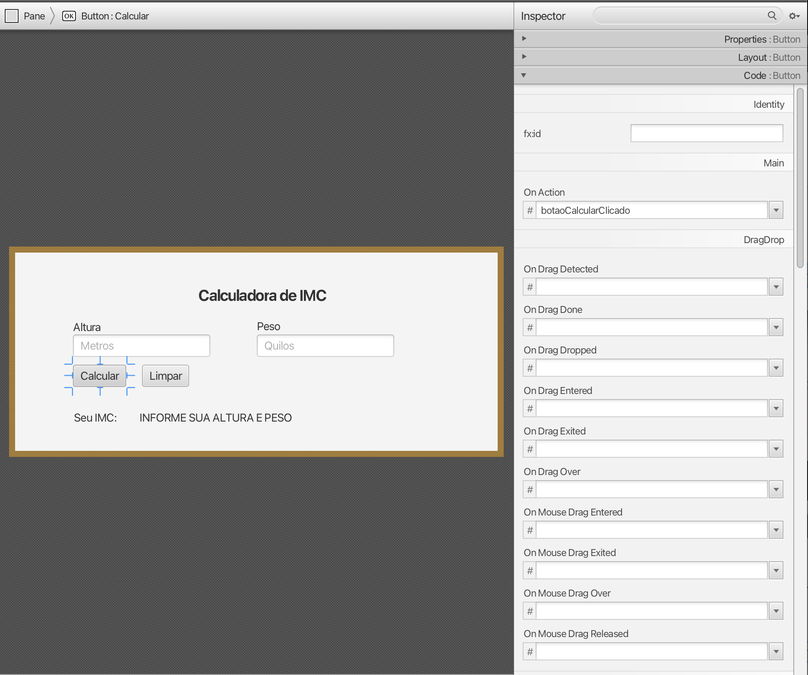

# Tutorial JavaFX com MVC

## Ambiente utilizado
* BlueJ 5.2.1, pré-instalado com:
  * JDK 17.0.4.1
  * JavaFX 20.0.1
* Scene Builder 21.0.0
* Scene Builder Plugin 0.0.1
* Git

## Instalar os Pré-Requisitos

Antes de executar o projeto-exemplo, é necessário instalar alguns programas no seu computador.

### Instalar o Git

Caso o seu ambiente de desenvolvimento seja Windows, faça o download do instalador 

### Instalar o BlueJ, JDK 17 e JavaFX 20.0.1

Acesse o site do BlueJ e faça o download do instalador para o seu sistema operacional: https://www.bluej.org/


O JDK 17 e o JavaFX 20.0.1 já estão pré-instalados no BlueJ.

### Instalar o Scene Builder

Acesse o site do Scene Builder e faça o download do instalador para o seu sistema operacional: https://gluonhq.com/products/scene-builder/


### Instalar o Scene Builder Plugin

Acesse a página de extensão do BlueJ (https://www.bluej.org/extensions/extensions2.html) e faça o download do arquivo [BlueJSceneBuilder.jar](https://www.bluej.org/extensions/files2/BlueJSceneBuilder.jar)


Copie este arquivo em a pasta de extensões (extensions2) do BlueJ, conforme seu sistema operacional:


Reinicie o BlueJ. Se der certo, os arquivos com extensão `.fxml` poderão ser abertos no Scene Builder através do BlueJ.

## Baixe e execute o projeto-exemplo

O exemplo deste tutorial foi desenvolvido no BlueJ e utiliza o JavaFX com o padrão arquitetural [Model-View-Controller](https://pt.wikipedia.org/wiki/MVC) (MVC). Para executar o projeto, siga os passos abaixo:

Abra um terminal bash (no Linux) ou powershell (no Windows) e clone o repositório de tutoriais:
  
```bash
git clone https://github.com/marceloakira/tutorials.git
```

Em seguida, acesse a pasta do projeto de JavaFX com MVC:
```bash
cd tutorials/javafx-mvc
```

Abra o BlueJ e abra o projeto `javafx-mvc` que você acabou de baixar.
* No menu do BlueJ, acesse 'Projeto' -> 'Abrir Projeto...'


* Selecione a pasta `javafx-mvc` e clique em 'Abrir'


* Para executar o projeto, crie uma instância da classe 'IMCController'


* Em seguida, no objeto criado, clique com o botão direito e selecione 'iniciar'


* Depois preencha os dados solicitados e clique em 'Calcular'


## Abra o arquivo FXML no Scene Builder

A interface gráfica do projeto foi criada no software Scene Builder. Mantido pela [Gluon](https://gluonhq.com/), o [Scene Builder](https://gluonhq.com/products/scene-builder/) é uma ferramenta gráfica para a criação de interfaces JavaFX.

Para abrir o arquivo FXML no Scene Builder, siga os passos abaixo:

* No BlueJ, clique com o botão direito no arquivo `imc.fxml` e selecione 'Open (outside BlueJ)'


Caso o Scene Builder esteja instalado corretamente, o arquivo FXML será aberto no Scene Builder.


Para a criação desta tela, foi inicialmente arrastado um componente Panel para o centro da tela. Em seguida, foram adicionados os componentes Label, TextField e Button. Os atributos de cada componente foram configurados na aba 'Properties' do Scene Builder.


Para criar telas e configurar as propriedades de cada componentes, consulte outros tutoriais disponíveis na internet. Um bem recomendado é o [Tutorial JFX Jenkov](https://jenkov.com/tutorials/javafx/index.html).

Toda tela produzida no Scene Builder é salva em um arquivo FXML. Este arquivo é um arquivo [XML](https://pt.wikipedia.org/wiki/XML) que contém a descrição da interface gráfica. Abra o arquivo `imc.fxml` em uma [IDE](https://pt.wikipedia.org/wiki/Ambiente_de_desenvolvimento_integrado) como o [VSCode](https://code.visualstudio.com/) para visualizar o código XML gerado pelo Scene Builder.


## Analise a classe IMCView (Visão)

A classe `IMCView` é a visão do padrão arquitetural [Model-View-Controller](https://pt.wikipedia.org/wiki/MVC). A visão é responsável por exibir a interface gráfica e capturar os eventos do usuário. Veja o código da classe `IMCView`:

```java
import javafx.application.Application;
import javafx.fxml.FXMLLoader;
import javafx.scene.Scene;
import javafx.scene.layout.Pane;
import javafx.stage.Stage;
import java.io.File;
import java.net.URL;

/**
 * Interface Gráfica (GUI) da Calculadora de IMC
 * 
 * @author marceloakira
 * @version 0.01
 */
public class IMCView extends Application
{
    private FXMLLoader loader;
    private URL url;
    
    public IMCView() {
        this.loader = new FXMLLoader();
        try {
            this.url = new File("imc.fxml").toURI().toURL();
        } catch (Exception e) {
            System.out.println("Erro na carga do FXML:" + e);
        }
        this.loader.setLocation(this.url);        
    }
    
    public void setController(IMCController controller) {
        this.loader.setController(controller);
    }
    
    @Override
    public void start(Stage primaryStage) throws Exception {
        Pane pane = loader.<Pane>load();
        Scene scene = new Scene(pane);
        primaryStage.setScene(scene);
        primaryStage.show();
    }
}
```

Note que a classe `IMCView` é uma subclasse de `Application` do JavaFX. No construtor da classe, é configurado um carregador de arquivos FXML - a classe FXMLLoader, que utiliza uma URL que aponta para o arquivo FXML `imc.fxml`. Como a carga pode envolver várias exeções, foi utilizado um bloco [try-catch](https://www.dio.me/articles/entendendo-o-try-e-catch-em-java) para capturar possíveis exceções, tais como: arquivo inexistente, URL inválida, etc.

O método `start` reescrito do método herdado da superclasse (note a anotação @Override) é o ponto de entrada da aplicação JavaFX. Neste método, é carregado um painel (Pane) a partir do arquivo FXML e exibido em uma janela (Stage) com uma cena (Scene).

Para executar uma aplicação JavaFX, o BlueJ oferece uma maneira simples de iniciar a aplicação. Basta clicar na classe 'IMCView' e selecionar 'Executar aplicação JavaFX'.


Caso esteja tudo correto, a interface gráfica será exibida na tela.


Em nosso caso, a aplicação JavaFX está funcional pois foram feitas previamente todas as configurações do controller (IMCController) e do arquivo FXML (imc.fxml) para que a aplicação funcione corretamente. Mas caso a classe controller IMCController ainda não existisse, seria apresentada uma tela sem reações nenhuma, pois não teria nenhuma ação programada. Isso é o esperado, pois a visão (IMCView) não deve conter lógica de negócio, apenas a exibição da interface gráfica.

## Analise a classe IMC (Modelo)

A classe `IMC` é o modelo do padrão arquitetural [Model-View-Controller](https://pt.wikipedia.org/wiki/MVC). A classe modelo é responsável por armazenar os dados e implementar os métodos que refletem o comportamento da entidade modelada. 

### Consultando a documentação da classe IMC
Note que esta classe possui comentários [Javadoc](https://pt.wikipedia.org/wiki/Javadoc), que são comentários especiais que podem ser interpretados por ferramentas de documentação, como o próprio BlueJ. 

Veja os comentários acima da própria classe e dos métodos da classe `IMC`:


Estes comentários servem para documentar o código-fonte e facilitar a compreensão do código por outros desenvolvedores. Para se visualizar a documentação gerada automaticamente, basta selecionar a opção 'Documentação' disponível no editor de código do BlueJ:


Quando essa opção é selecionada, a documentação gerada automaticamente é exibida: 

Na documentação, podemos identificar a descrição da classe e cada método, se retorno e parâmetros, além de outras informações relevantes.

### Testando a classe IMC

Para testar a classe `IMC`, crie uma instância da classe com parâmetros de peso e altura e chame o método `calcular` ou `interpretar` com os valores de peso e altura desejados. Veja os exemplos abaixo:

* método calcular


* método interpretar


## Leia a classe IMCController (Controlador)

Vimos que as classes 'IMCView' e 'IMC' são a visão e o modelo, respectivamente, do padrão arquitetural [Model-View-Controller](https://pt.wikipedia.org/wiki/MVC). Fizemos testes em separado de cada uma e vimos que elas funcionam independentemente uma da outra. Por outro lado, a classe 'IMCController' é o controlador, que é responsável por intermediar a comunicação entre a visão e o modelo.

Essa intermediação é feita através de métodos que são chamados quando o usuário interage com a interface gráfica. No nosso exemplo, temos dois métodos: `botaoCalcularClicado` e `botaoLimparClicado`. O primeiro é chamado quando o usuário clica no botão 'Calcular' e o segundo é chamado quando o usuário clica no botão 'Limpar'.

### Configurando a visão para notificar o controlador

Para indicar quais métodos a visão deve chamar quando o usuário interage com a interface gráfica, é necessário configurar o arquivo `imc.fxml` através da ferramenta Scene Builder. Essa configuração é feita através da aba 'Code' do Scene Builder.



No exemplo acima, o método `botaoCalcularClicado` foi configurado para ser chamado quando o usuário clicar no botão 'Calcular', quando ocorrer o evento 'OnAction'. Cada componente pode ter vários eventos configurados, como 'OnMouseEntered', 'OnMouseExited', 'OnKeyPressed', etc. Que correspondem a eventos do mouse, teclado, etc. Veja uma tabela didática de eventos JavaFX:


Fonte: https://www.tutorialspoint.com/javafx/javafx_using_convenience_methods.htm


O método `botaoLimparClicado` foi configurado para ser chamado quando o usuário clicar no botão 'Limpar'. Ele possui uma implementação simples, que apenas limpa os campos de texto e o rótulo de resultado:

```java
...
public void botaoLimparClicado(Event e) {
    textFieldAltura.setText("");
    textFieldPeso.setText("");
    labelResultado.setText("");
}
...
```

Os métodos que recebem chamadas da view quando um evento ocorre são chamados de 'callbacks'. Eles são chamados assim porque a visão 'chama de volta' o controlador quando um evento ocorre. Também são chamados de 'event handlers' - tratadores de eventos - ou 'event listeners' - escutadores de eventos.

O código do método `botaoCalcularClicado` é um pouco mais complexo, pois ele precisa capturar os valores dos campos de texto, transformar os dados de String para valores double e criar uma instância da classe 'IMC' e chamar o método `interpretar` para obter o resultado do cálculo do IMC. Veja o código abaixo:

```java
...
    public void botaoCalcularClicado(Event e) {
        try {
            double altura = Double.parseDouble(textFieldAltura.getText());
            double peso = Double.parseDouble(textFieldPeso.getText());
            IMC imc = new IMC(altura, peso);
            this.labelResultado.setText(imc.interpretar());
        } catch (NumberFormatException exception) {
            labelResultado.setText("Dados de entrada incompletos ou inválidos");
        }
    }
...
```

Como a transformação de String para double pode gerar uma exceção, foi utilizado um bloco `try-catch` para capturar a exceção e exibir uma mensagem de erro na interface gráfica.

## Configurando identificadores de componentes da visão

Note que o controlador precisa acessar os componentes da visão para obter os valores dos campos de texto e exibir o resultado do cálculo do IMC. Para isso, é necessário configurar identificadores para os componentes da visão. Esses identificadores são utilizados para acessar os componentes da visão no controlador.

No código da classe `IMCController`, os componentes da visão são declarados como atributos da classe com acesso público:

```java
...
    public TextField textFieldAltura;
    public TextField textFieldPeso;
    public Label labelResultado;
...
```

Isso permite que o loader do arquivo FXML faça uma ligação automática (binding) dos componentes da visão e os atribua aos atributos da classe `IMCController`. Para isso, é necessário configurar os identificadores dos componentes no arquivo FXML com os mesmos nomes no Controlador e na Visão. No exemplo abaixo, os identificadores dos componentes são preenchidos no Scene Builder, na aba 'Code', no campo 'fx:id':


## Código completo da classe IMCController

Segue o código completo da classe 'IMCController':

```java
import javafx.stage.Stage;
import javafx.event.Event;
import javafx.scene.control.TextField;
import javafx.scene.control.Label;

/**
 * Controla os dados do modelo e a interação com a interface (visão)
 * 
 * @author (seu nome) 
 * @version (um número da versão ou uma data)
 */
public class IMCController
{
    IMCView imcView;
    Stage stage;
    IMC imc;
    public TextField textFieldAltura;
    public TextField textFieldPeso;
    public Label labelResultado;
    
    /**
     * Construtor para objetos da classe IMCController
     */
    public IMCController()
    {
        this.stage = new Stage();
        this.imcView = new IMCView();
        this.imcView.setController(this);
    }
    
    public void iniciar() throws Exception {
        this.imcView.start(this.stage);
        this.stage.show();
    }
    
    public void botaoCalcularClicado(Event e) {
        try {
            double altura = Double.parseDouble(textFieldAltura.getText());
            double peso = Double.parseDouble(textFieldPeso.getText());
            IMC imc = new IMC(altura, peso);
            this.labelResultado.setText(imc.interpretar());
        } catch (NumberFormatException exception) {
            labelResultado.setText("Dados de entrada incompletos ou inválidos");
        }
    }
    
    public void botaoLimparClicado(Event e) {
        textFieldAltura.setText("");
        textFieldPeso.setText("");
        labelResultado.setText("");
    }    
}
```

## Conclusão

Neste tutorial, aprendemos a criar uma aplicação JavaFX com o padrão arquitetural [Model-View-Controller](https://pt.wikipedia.org/wiki/MVC). Vimos como criar a visão (IMCView), o modelo (IMC) e o controlador (IMCController) e como configurar a comunicação entre eles. Aprendemos a configurar a visão para notificar o controlador quando o usuário interage com a interface gráfica e como o controlador acessa os componentes da visão para obter os dados e exibir o resultado do cálculo do IMC.

## Referências:
* JavaFX API: https://openjfx.io/javadoc/21/index.html
* Tutorial JFX Jenkov: https://jenkov.com/tutorials/javafx/fxml.html#binding-javafx-components-to-controller-fields